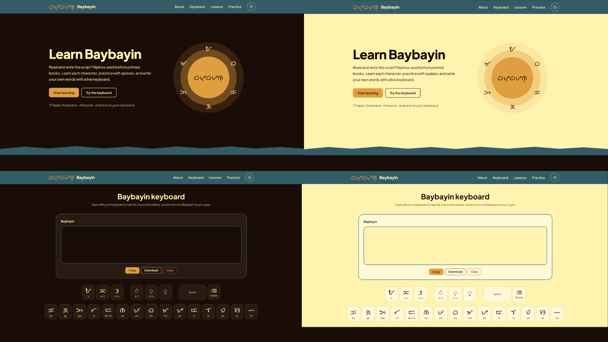
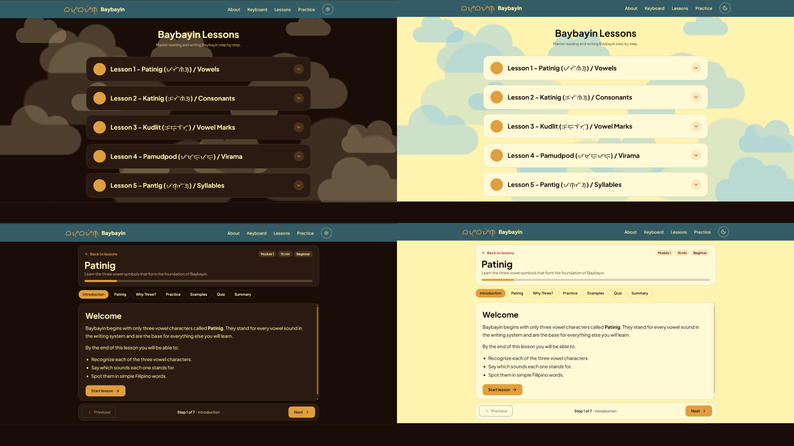
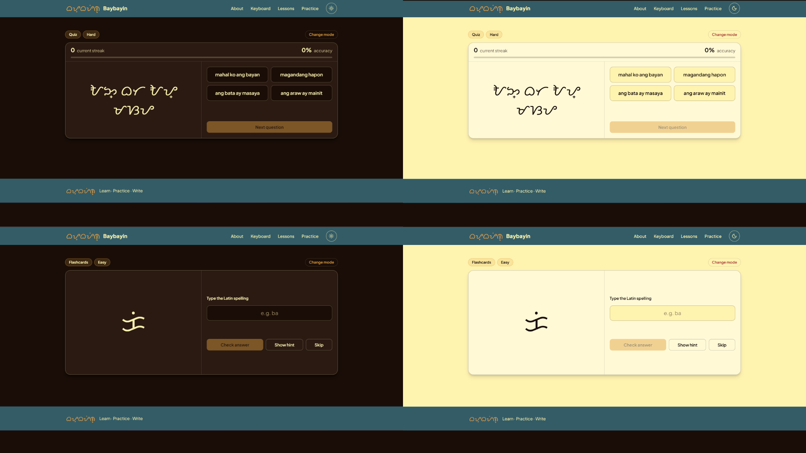

# Baybayin Learning Platform

An interactive web application designed to help beginners learn the Baybayin writing system through structured lessons, hands-on practice, and an integrated Baybayin keyboard.

Instead of presenting Baybayin as a static reference chart, the platform guides learners through a progressive learning path—from understanding individual characters to reading and writing complete words and phrases. The application emphasizes simplicity, accessibility, and a modern user experience suitable for both desktop and mobile devices.

## 🌐 Live Demo

**GitHub Pages:** https://aaronnedelacruz.github.io/baybayin-learning-platform/

## 📂 Repository

**GitHub:** https://github.com/aaronnedelacruz/baybayin-learning-platform

---

# 📸 Preview

---

# ✨ Major Features

| Feature                      | Description                                                                             |
| ---------------------------- | --------------------------------------------------------------------------------------- |
| ⌨️ **Baybayin Keyboard**     | Write Baybayin characters directly in the browser using an integrated virtual keyboard. |
| 📖 **Structured Lessons**    | Learn Baybayin through six progressive lessons designed for beginners.                  |
| 🎯 **Practice Modes**        | Reinforce learning using Flashcards and Quiz modes with three difficulty levels.        |
| 🌙 **Light & Dark Theme**    | Switch themes with persistent user preference.                                          |
| 📱 **Responsive Design**     | Optimized for desktop, tablet, and mobile devices.                                      |
| ⚡ **Interactive Experience** | Instant feedback, hints, animations, and responsive interactions.                       |

---

# 🛠 Tech Stack

| Category        | Technologies                          |
| --------------- | ------------------------------------- |
| **Frontend**    | React, TypeScript, Vite               |
| **Routing**     | React Router                          |
| **Styling**     | CSS, CSS Variables, Flexbox, CSS Grid |
| **Icons**       | Lucide React                          |
| **Development** | Git, GitHub, npm, Visual Studio Code  |

---

# ⌨️ Baybayin Keyboard

The integrated Baybayin keyboard allows users to type Baybayin characters directly in the browser without installing additional fonts or keyboard layouts.

### Features

* Complete Baybayin character set
* Kudlit support
* Pamudpod support
* Copy generated text
* Clear text instantly
* Responsive keyboard layout

---

# 📖 Lessons

The platform teaches Baybayin through six structured lessons that gradually introduce each concept before moving on to the next.

| Lesson   | Topic                |
| -------- | -------------------- |
| Lesson 1 | Patinig (Vowels)     |
| Lesson 2 | Katinig (Consonants) |
| Lesson 3 | Kudlit (Vowel Marks) |
| Lesson 4 | Pamudpod (Virama)    |
| Lesson 5 | Pantig (Syllables)   |
| Lesson 6 | Writing in Baybayin  |

Each lesson includes:

* Beginner-friendly explanations
* Visual examples
* Guided activities
* Practice exercises
* A progress indicator showing how far the learner has progressed within the current lesson

---

# 🎯 Practice

Practice mode allows learners to reinforce what they have learned after completing the lessons.

Both **Flashcards** and **Quiz** support three difficulty levels:

* 🟢 **Easy** — Pantig (Syllables)
* 🟡 **Medium** — Salita (Words)
* 🔴 **Hard** — Pangungusap (Sentences & Phrases)

## Flashcards

Designed for unlimited self-paced practice.

### Features

* Endless randomized questions
* Three difficulty levels
* Instant answer checking
* Optional hints
* Skip questions
* Retry incorrect answers
* Accepts valid Baybayin spelling variations (I/E, U/O, and D/R)

---

## Quiz

Test your recognition skills through multiple-choice questions.

### Features

* Multiple-choice questions
* Three difficulty levels
* Randomized answer choices
* Accuracy tracker
* Current streak counter
* Immediate feedback
* Difficulty-based question pools

---

# 🎯 Project Goals

This project aims to:

* Make Baybayin approachable for beginners.
* Present lessons in a logical, progressive order.
* Encourage active learning through interactive exercises.
* Provide a clean and distraction-free interface.
* Deliver a responsive experience across desktop and mobile devices.
* Promote appreciation of the traditional Filipino writing system through accessible technology.

---

# 🔮 Future Improvements

* Save user progress
* Lesson completion tracking
* Achievement system
* Additional practice questions
* Audio pronunciation
* Stroke order demonstrations
* Expanded vocabulary and sentence exercises

---

# 👨‍💻 Developer

Developed by **Aaronne Christian E. Dela Cruz**

Feedback, suggestions, and contributions are always welcome.
